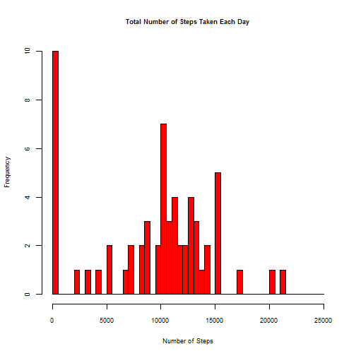
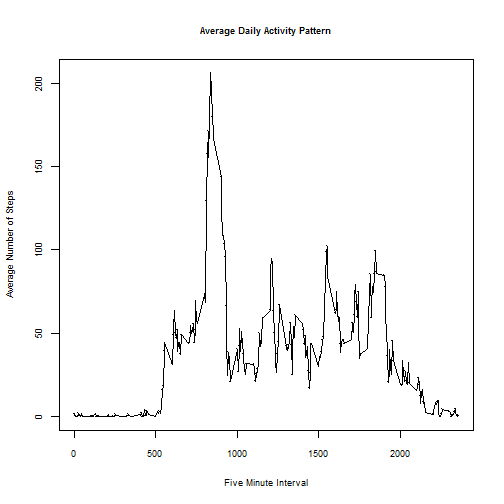
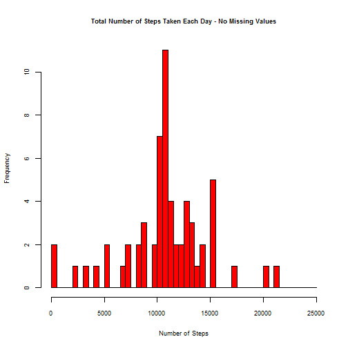
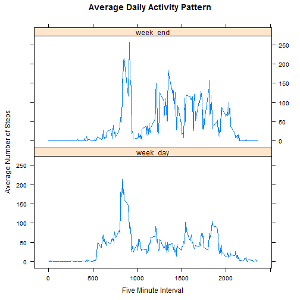

Reproducible Research: Peer Assessment 1
========================================

### By aerasso@stanfordalumni.org on September 2015.

Throughout this report we always include the code used to generate the output.


## Overview

This assignment makes use of data from a personal activity monitoring device. This device collects data at 5 minute intervals through out the day. The data consists of two months of data from an anonymous individual collected during the months of October and November, 2012 and include the number of steps taken in 5 minute intervals each day.

## Loading and preprocessing the data
The data for this assignment is downloaded from the course web site.
Dataset: Activity monitoring data [52K]

The variables included in this dataset are:

* **steps**: Number of steps taking in a 5-minute interval (missing values are coded as NA)

* **date**: The date on which the measurement was taken in YYYY-MM-DD format

* **interval**: Identifier for the 5-minute interval in which measurement was taken

The dataset is stored in a comma-separated-value (CSV) file and there are a total of 17,568 observations in this dataset.


```r
# <!-- rmarkdown v1 -->
workdir<-getwd()

fpath1 = file.path(workdir, "repdata-data-activity.zip")
if (!file.exists(fpath1)){
    fileUrl <- "https://d396qusza40orc.cloudfront.net/repdata%2Fdata%2Factivity.zip"
    download.file(fileUrl, "./repdata-data-activity.zip")
} 

unzip("repdata-data-activity.zip")

dataset <- read.csv("activity.csv", header=TRUE, sep=",")

# Note: date is a factor with format yyyy-mm-dd in dataset and has to be converted to date 
# type POSIXct
day<-strptime(dataset$date, "%Y-%m-%d")
weekday <- weekdays (day)

# New columns added to dataframe dataset 
dataset <- cbind(dataset,day)
dataset <- cbind(dataset,weekday)

# Checking if package "data.table" is installed. If not, then installing it
if (!"data.table" %in% rownames(installed.packages())){
    install.packages("data.table")
}
library(data.table)
```

```
## Warning: package 'data.table' was built under R version 3.1.2
```

```r
# Checking if package "dplyr" is installed. If not, then installing it
if (!"dplyr" %in% rownames(installed.packages())){
    install.packages("dplyr")
}
library("dplyr")
```

```
## Warning: package 'dplyr' was built under R version 3.1.3
```

```
## 
## Attaching package: 'dplyr'
## 
## The following objects are masked from 'package:data.table':
## 
##     between, last
## 
## The following object is masked from 'package:stats':
## 
##     filter
## 
## The following objects are masked from 'package:base':
## 
##     intersect, setdiff, setequal, union
```

## What is mean total number of steps taken per day?
We ignore the missing values in the dataset, for now.

```r
# Filtering dataset to obtain the required data

dailysteps <- group_by(dataset, day)
daily_total <- summarize(dailysteps, 
                totday = sum(steps, na.rm = TRUE)) # Excludes NA values

# Histogram
par(mfrow = c(1, 1))  # Resetting layout
his_break <- seq(0,25000,500)
with(dailysteps, hist(daily_total$totday,
                   main = "Total Number of Steps Taken Each Day",
                   xlab="Number of Steps",
                   breaks=his_break,
                   col=2,
                   cex.main=0.75,
                   cex.axis=0.75,
                   cex.lab=0.75,
                   bg = "transparent"
                   
)) 
```

 

The mean and median of the total number of steps taken every day are, respectively:


```r
daily_mean <- mean(daily_total$totday, na.rm = TRUE) # Excludes NA values
daily_median <- median(daily_total$totday, na.rm = TRUE) # Excludes NA values
daily_mean 
```

```
## [1] 9354.23
```

```r
daily_median
```

```
## [1] 10395
```

## What is the average daily activity pattern?
We count the number of steps for each of the 5 minute intervals. Intervals are identified using the convention "xxyy"" where xx means the hours and yy the minutes at start time. For example, 1345 means 13:45 or 1:45 PM.


```r
# Filtering dataset to obtain the required data

intersteps <- group_by(dataset, interval)
avg_daily_pattern <- summarize(intersteps,
                        mean_interval = mean(steps, na.rm = TRUE))

## Resetting layout
par(mfrow = c(1, 1))

## Make plot appear on screen device
with(intersteps, {plot(avg_daily_pattern$interval,avg_daily_pattern$mean_interval,
                    main = "Average Daily Activity Pattern",
                    xlab="Five Minute Interval",
                    ylab="Average Number of Steps",
                    col=1,
                    cex.main=0.75,
                    cex.axis=0.75,
                    cex.lab=0.75,
                    pch=".",
                    bg = "transparent")
               
               lines(avg_daily_pattern$interval,avg_daily_pattern$mean_interval)}
)
```

 

The maximum number of steps for all 5-minute intervals, on average across all the days in the dataset, is:


```r
max(avg_daily_pattern$mean_interval)
```

```
## [1] 206.1698
```
It happens during the interval that starts at:

```r
max_interval <- avg_daily_pattern[avg_daily_pattern$mean_interval==max(avg_daily_pattern$mean_interval), 1]
as.numeric(max_interval)
```

```
## [1] 835
```

## Inputing missing values
The total number of missing values is

```r
# Total number of missing values
complete<-complete.cases(dataset$steps)
num_missing_val <-length(dataset$steps) - sum(complete)
num_missing_val
```

```
## [1] 2304
```

Now we assign the mean number of steps for each 5 minute interval to every missing value to enrich the data set.

```r
# Filling out missing values by assigning the mean number of steps for each 5 minute interval to every missing value.
# Solution is to add a new column instead of replacing the old column with the original values
new_dataset<- mutate(dataset, all_steps = ifelse(is.na(dataset$steps), avg_daily_pattern$mean_interval, dataset$steps))
       
new_dailysteps <- group_by(new_dataset, day)
new_daily_total <- summarize(new_dailysteps, 
                         totday = sum(all_steps, na.rm = TRUE)) # Excludes NA values
# Histogram
par(mfrow = c(1, 1))  # Resetting layout
his_break <- seq(0,25000,500)
with(dailysteps, hist(new_daily_total$totday,
                      main = "Total Number of Steps Taken Each Day - No Missing Values",
                      xlab="Number of Steps",
                      breaks=his_break,
                      col=2,
                      cex.main=0.75,
                      cex.axis=0.75,
                      cex.lab=0.75,
                      bg = "transparent"
)) 
```

 

The new mean and median of the total number of steps taken every day are, respectively:


```r
new_daily_mean <- mean(new_daily_total$totday, na.rm = TRUE) # Excludes NA values
new_daily_median <- median(new_daily_total$totday, na.rm = TRUE) # Excludes NA values
new_daily_mean
```

```
## [1] 10766.19
```

```r
new_daily_median
```

```
## [1] 10766.19
```
The impact of adding new values to the data set is that the mean and the median are now the same, and the shape of the histogram is mores ymmetrical and shifted towards higher values for the total number of steps per day.

## Are there differences in activity patterns between weekdays and weekends?
Next, we determine the differences between the total number of steps taken during weekdays and during weekends 


```r
new_dataset<-mutate(new_dataset, type_of_day = ifelse(weekday=="Saturday"|weekday=="Saturday","week_end","week_day"))

library(lattice)
new_intersteps <- group_by(new_dataset, interval,type_of_day)
avg_type_of_day_pattern <- summarize(new_intersteps,
                               mean_interval = mean(all_steps, na.rm = TRUE))

xyplot(mean_interval ~ interval | type_of_day, data = avg_type_of_day_pattern, layout = c(1, 2), type="l",
       main = "Average Daily Activity Pattern",
       xlab="Five Minute Interval",
       ylab="Average Number of Steps",
       ) 
```

 

Weekends show more steps over a longer part of the day, from 5:00 AM to 9:00 PM than weekdays, when activity decreases markedly after 10:00 AM. It seems that the sample subject exercises or has more phisical activity after noon on Saturday and Sunday than on the other days.
